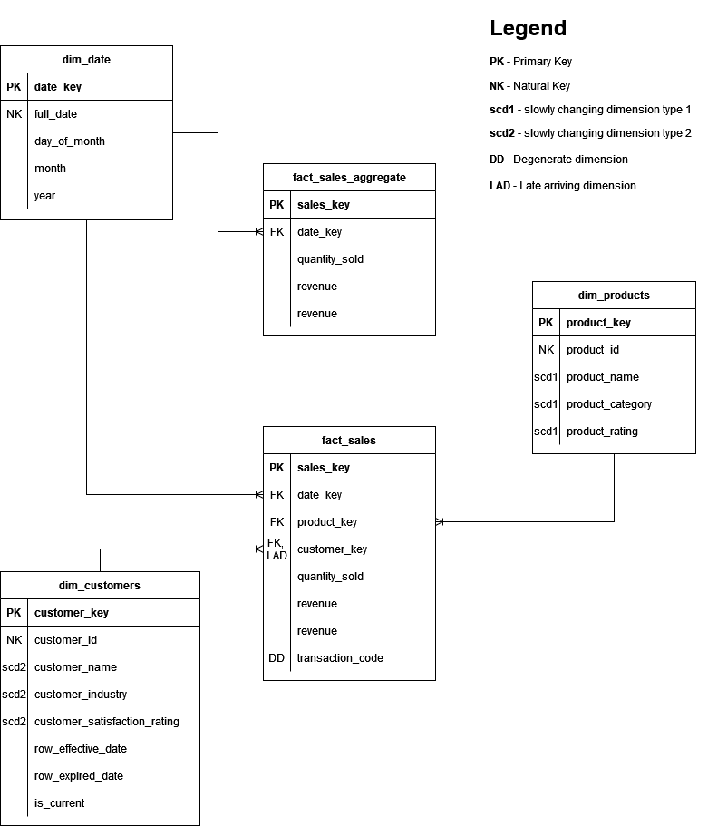

# Showcase Data Solution

## Overview

Projects showcases modern data solution built using contemporary tools, processes, and best practices.

## Architecture

Instead of relying on outside data sources, I've decided to simulate them by building my own API endpoints that serves data for the project. Endpoints are built using API Gateway and Lambda functions (python runtime) as backend.

Lambda functions are also used to extract data from API Endpoints, transform it, and upload to S3

S3 bucket acts as a data lake for extracted data. Bucket is partitioned by date value provided by Airflow

Orchestration is implemented by Airflow. More detailed info can be found in Data Pipeline section

Airflow is run locally on Docker containers

Redshift hosts tables and major data transformation logic, such as data quality scripts, scd1 and scd2 dimension table upserts, and fact table upserts.

DataOps is implemented by git, GitHub Actions (CICD pipeline), and AWS SAM template (IaaC)


### Data Pipeline

Pipeline orchestrates lambda functions and redshift code. Lambdas are used for data extraction from API endpoints, light data transformation, and upload to S3 bucket. Redshift code hosts upserts and data quality code

Pipeline uses {{ ds }} Airflow template that gets resolved into yyyy-mm-dd to sync data extraction and transformation for all components. 
For example, URL for sales data extraction is /sales?date=yyyy-mm-dd.
Lambdas also get {{ ds }} value from Airflow, so they can properly partition S3 bucket and upload daily data. Partitioning scheme is S3://showcase-data-pipeline/yyyy-mm-dd/data_files.*

For dim tables, full table extract is implemented

For fact_sales, delta extraction and incremental load are implemented. Every day, only data for that day ({{ ds }} -> Airflow logical date) is extracted from /sales endpoint and sent for further processing downstream


## Data Model

Data model is Kimball stype star schema. 
Data model follows bronze-silver-gold structure. S3 bucket holds bronze data, partitioned and growing with every data load. Fact_sales within dimensional model shown here holds deduped and enriched silver data. Fact_sales_aggregate holds gold aggregated sales data ready for analytics 




## Tech

Airflow: Orchestrator for Lambda functions and Redshift code 

Docker: Enables consistent and reproducible local Airflow deployment

GitHub Actions: CI/CD service, automating building and deployment of data solution to AWS cloud

GitHub: Version control

SQL: Data modeling and transformation logic within Redshift 

Python: Backend language for HTTP APIs in AWS Lambda; also used for API data extraction logic and writing Airflow orchestration code

AWS SAM Framework: SAM templates and SAM CLI for development, testing, and deployment of serverless apps, including Lambda functions, S3 bucket, and API Gateway endpoints

AWS SAM Template: IaaC for the project, extends AWS CloudFormation

AWS Lambda: Serverless backend service for APIs, and API data extraction logic

AWS S3: Object storage and data lake 

AWS Redshift: Cloud data warehouse 

AWS API Gateway: Hosts API endpoints, acts as a data source

## Project Structure

```bash
/project-root
|--/.github/workflows/cicd.yaml         # CI/CD pipeline definition
|-- /airflow
|   |--/dags
|      |--/sql                          # holds sql code executed by Redshift
|      |-- redshift_config.txt          # sql config file for Redshift connection in Airflow
|      |-- showcase_data_pipeline.txt   # airflow data pipeline definition
|   docker-compose.yaml                 # docker-compose file for starting up Airflow containers locally
|-- /src/                               # contains code for all lambda functions, along with requirements files are all other necessary files
|--.gitignore
|--.pre-commit-config.yaml              # pre-commit hooks executing Black code formatter before each commit
|--requirements-dev                     # requirements file holding python dependencies used during development
|--samconfig.toml                       # config file containing AWS SAM framework configuration
|--template.yaml                        # file holding AWS SAM IaaC 
|--README.md
```

## Setup

### Clone the repository
```bash
git clone https://github.com/mradobuljac/showcase-data-pipeline
```

### Install necessary tools
- Install Docker
- Install AWS CLI and configure access_key and secret_access_key
- Install AWS SAM CLI

### Redshift 
- Provisioning Redshift from IaaC template is not in scope of this project. Please create your own cluster
- Please ensure that IAM role attached to your cluster can COPY from S3, and that Cluster can be accessed from local clients, including Airflow
- change airflow/dags/redshift_config.txt values to your cluster values
- change IAM Role in s3_to_stage_products.sql, s3_to_stage_sales.sql, and s3_to_stage_customers.sql to IAM role attached to your cluster

### Deploy SAM project to cloud
```bash
cd showcase-data-pipeline
sam build 
sam deploy --no-confirm-changeset --no-fail-on-empty-changeset
```


### Setup Airflow
```bash
cd showcase-data-pipeline/airflow
docker compose up airflow-init
docker compose up
```
- alternatively, follow official instructions https://airflow.apache.org/docs/apache-airflow/stable/howto/docker-compose/index.html
- to enter web UI to manage and observe workflows, go to http://localhost:8080/home
  - username: airflow
  - password: airflow 
- To connect Airflow with AWS, we need to create a connection! Make sure to name it **aws_conn**! Go to Admin -> Connections -> Add a new record: 

 

- that's it! You can now open showcase_data_pipeline and run it


